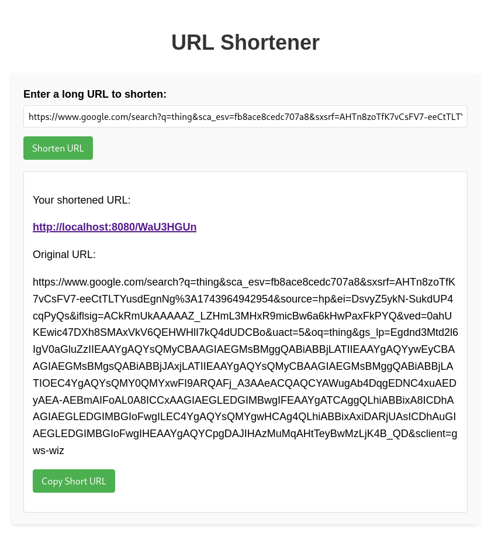

# URL Shortener Application

A simple, easy-to-use web application to shorten long URLs into short, shareable links.  
Built with HTML, CSS, Go (for backend), and a bit of JavaScript magic ✨


## Features

- ✅ Enter any long URL and get a short version
- ✅ Copy the shortened URL to your clipboard with one click
- ✅ Clean and responsive user interface
- ✅ Original (long) URL is displayed with proper text wrapping
- ✅ Error handling for invalid inputs or API errors


## Getting Started

### Prerequisites

Before running this application, ensure you have the following installed:

- **Go** (version 1.16+)
- **Docker** (optional, if using Docker for deployment)
- **Docker Compose** (optional, for database setup)

### Usage

1. Clone the repository

```bash
git clone https://github.com/your-username/url-shortener.git
cd url-shortener
```

2. Start the application:

```bash
docker-compose up --build 
```

3. Head to http://localhost:8080

4. Insert any URL you would like to shorten in the text field

## 🛠️ Tech Stack

- **Backend**:  
  - **Go (Golang)** – The backend is built using Go for handling HTTP requests, generating short URLs, and interacting with the database.
  - **Gin** – A web framework for Go that simplifies routing and middleware.
  - **PostgreSQL** – A relational database for storing long URLs, their shortened versions, and other metadata like click count.

- **Frontend**:  
  - **HTML5** – Basic HTML structure for the user interface.
  - **CSS3** – Styling of the application using inline styles (or external stylesheets).
  - **JavaScript** – For client-side interactivity, such as making API requests and updating the UI dynamically.
  
- **Others**:
  - **Docker** – Used for containerizing the application and the PostgreSQL database for easier deployment.
  - **Docker Compose** – Simplifies managing multi-container applications (e.g., running both the Go app and PostgreSQL together).


## Showcase


